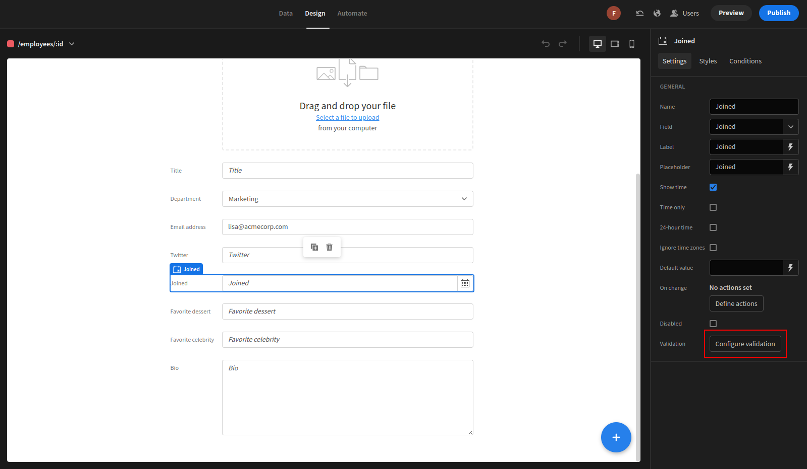
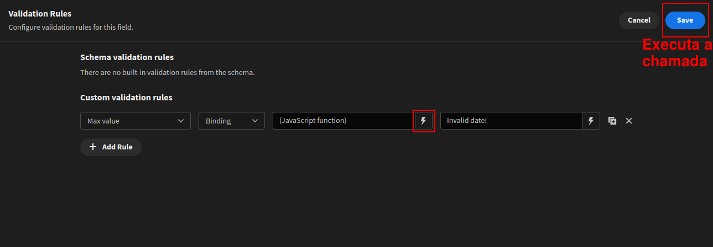

# Integração Budibase/Git - Frontend

Esse projeto é uma extensão do Chrome, que intercepta uma alteração em específico na [tela de alteração de funcionário](https://fterrana.budibase.app/builder/app/app_dev_fterrana_5ace81689bc84f28b6ecaf1f558f2935/design/screen_2710a29c4952477e821ddf7c0640ed20/components/ca459d6d09218417887e295e3572558c1).

Quando o script de validação do campo "Joined" é alterado com essa extensão ativa e o backend escutando na porta 8080, o conteúdo do novo script é selecionado e enviado para o commit.

## Instruções de execução

No Google Chrome, acessar "Extensões" > "Gerenciar Extensões", e ativar a flag de "Modo desenvolvedor". Depois, basta selecionar a opção de carregar extensão e selecionar a pasta do projeto baixada localmente.